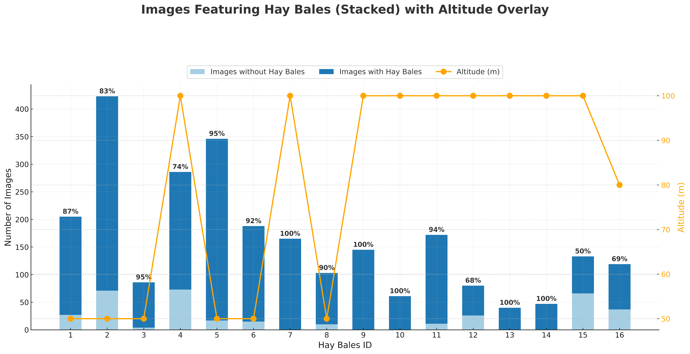

# BaleUAVision: UAV-Captured Hay Bale Dataset
<!--   -->
<p align="center">
  
</p>

<p align="center">
  
</p>


## Description
This dataset comprises a comprehensive collection of UAV-captured images of agricultural fields with hay bales. It includes high-resolution RGB imagery (in both raw and annotated -COCO, CSV, JSON, YOLO, Segmentation Masks- formats), catering to a wide range of applications from precision agriculture to machine learning in computer vision and autonomous navigation. More specifically, it encompasses detailed UAV-captured data from agricultural fields, characterized by varied flight parameters to optimize image capture for machine learning applications. This dataset is distinctive due to its diverse altitude range (50-100m), multiple speed settings (3.7-5m/s), and different overlap ratios ensuring comprehensive field coverage. The total area covered by the dataset is 938,715 square meters, with a Ground Sampling Distance (GSD) ranging from 1.53 to 3.06 cm/pixel, facilitating fine-grained analysis. The data includes 2,599 high-resolution RGB images, each meticulously annotated for semantic segmentation, and is coupled with orthophotos to support simulation tasks such as autonomous hay bale collection scenarios. This dataset is a valuable asset for advancements in precision agriculture, offering extensive resources for developing and testing computer vision and path-planning algorithms.

## Dataset Details
- **Images**: High-resolution RGB images of 16 Hay bale fields
- **Number of images**: 2,599
- **Formats**: Raw RGB images and Annotated images in {COCO, CSV, JSON, YOLO, Segmentation Masks} formats
- **Annotations**: Semantic segmentation with polygons
- **Dataset Task Type Usage**: Segmentation and Classification/Detection Tasks
- **Annotation Software Used**: Label Studio
- **Captured Fields**: The dataset includes imagery from 16 fields, with 14 located in the Xanthi region and 2 in the Drama region, both situated in the northern part of Greece
- **Orthophotos**: Orthomosaic views for each subset of the dataset, generated through an image stitching process, offering a macro-perspective of the fields
- **Size**: ~44GB 
- **Resolution**: 4056x3040 (RGB) 
- **Flight Parameters**: Various altitudes, speeds and overlaps
- **Geo-location**: Yes, each image is geo-referenced
- **Total Area Covered**: 938,715 square meters (m²) in total
- **Additional Information**: The number of hay bales has been manually counted for each field from the orthophoto representations, providing a reliable reference for users aiming to develop or evaluate algorithms for automated hay bale counting

## Dataset Details Table

| Attribute            | Description                                                                 |
|-----------------------|-----------------------------------------------------------------------------|
| **Images**           | High-resolution RGB images of 16 hay bale fields                          |
| **Number of Images** | 2,599                                                                     |
| **Formats**          | Raw RGB images and annotated images in {COCO, CSV, JSON, YOLO, Segmentation Masks} formats |
| **Annotations**      | Semantic segmentation with polygons                                       |
| **Dataset Task Type Usage** | Segmentation and Classification/Detection Tasks                    |
| **Annotation Software Used**      | Label Studio                                       |
| **Captured Fields**  | Imagery from 16 fields, with 14 located in the Xanthi region and 2 in the Drama region, both situated in the northern part of Greece |
| **Orthophotos**      | Orthomosaic views for each subset of the dataset, generated through an image stitching process, offering a macro-perspective of the fields          |
| **Size**             | ~44GB                                                                     |
| **Resolution**       | 4056 x 3040 (RGB)                                                         |
| **Flight Parameters**| Various altitudes, speeds, and overlaps                                   |
| **Geo-location**     | Yes, each image is geo-referenced                                         |
| **Total Area Covered**| 938,715 square meters (m²)                                                |
| **Additional Info**  | The number of hay bales has been manually counted for each field from the orthophoto representations, providing a reliable reference for users aiming to develop or evaluate algorithms for automated hay bale counting      |

## General Information and Metadata
| Dataset ID   | Altitude (m) | Takeoff Speed (m/s) | Speed (m/s) | Side Overlap (%) | Frontal Overlap (%) | GSD (cm/pixel) | Area (m²) | Flight Time | Photos | Hay Bale Count<sup><a href="#footnote1">*</a></sup> |
|--------------|--------------|---------------------|-------------|------------------|---------------------|----------------|-----------|-------------|--------|---------------|
| hay bales 1  | 50           | 10                  | 3.7         | 70               | 80                  | 1.53           | 22,339    | 9 m 3 s     | 205    | 41 + 0        |
| hay bales 2  | 50           | 10                  | 3.7         | 70               | 80                  | 1.53           | 59,796    | 18 m 34 s   | 423    | 49 + 0        |
| hay bales 3  | 50           | 10                  | 3.7         | 70               | 80                  | 1.53           | 7,718     | 3 m 55 s    | 86     | 17 + 0        |
| hay bales 4  | 100          | 10                  | 5.0         | 70               | 80                  | 3.06           | 166,778   | 19 m 30 s   | 286    | 107 + 5       |
| hay bales 5  | 50           | 10                  | 3.7         | 70               | 80                  | 1.53           | 47,865    | 15 m 23 s   | 346    | 69 + 0        |
| hay bales 6  | 50           | 10                  | 3.7         | 70               | 80                  | 1.53           | 21,367    | 8 m 22 s    | 188    | 31 + 0        |
| hay bales 7  | 100          | 10                  | 5.0         | 70               | 80                  | 3.06           | 68,327    | 10 m 24 s   | 165    | 67 + 20       |
| hay bales 8  | 50           | 10                  | 3.7         | 60               | 70                  | 1.53           | 24,376    | 6 m 31 s    | 103    | 38 + 13       |
| hay bales 9  | 100          | 10                  | 5.0         | 70               | 80                  | 3.06           | 67,371    | 9 m 17 s    | 145    | 94 + 40       |
| hay bales 10 | 100          | 10                  | 5.0         | 70               | 80                  | 3.06           | 25,423    | 3 m 40 s    | 61     | 31 + 12       |
| hay bales 11 | 100          | 10                  | 5.0         | 70               | 80                  | 3.06           | 79,038    | 10 m 52 s   | 172    | 51 + 14       |
| hay bales 12 | 100          | 10                  | 5.0         | 70               | 55                  | 3.06           | 80,005    | 11 m 7 s    | 80     | 58 + 11       |
| hay bales 13 | 100          | 10                  | 5.0         | 60               | 65                  | 3.06           | 33,296    | 4 m 7 s     | 40     | 83 + 0        |
| hay bales 14 | 100          | 10                  | 5.0         | 65               | 70                  | 3.06           | 30,462    | 4 m 20 s    | 47     | 54 + 9        |
| hay bales 15 | 100          | 10                  | 5.0         | 60               | 65                  | 3.06           | 140,991   | 14 m 25 s   | 133    | 40 + 0        |
| hay bales 16 | 80           | 10                  | 5.0         | 60               | 70                  | 2.45           | 63,563    | 8 m 59 s    | 119    | 33 + 0        |

<p id="footnote1"><strong>*</strong>: Count of hay bales identified by a human observer through manual inspection of the orthophotos, including both the primary field and any visible surrounding area -> (field + surrounding area) </p>


## Applications

The **UAV-Captured Hay Bale Dataset** can serve as a valuable resource in a variety of fields, including but not limited to:

- **Object Detection and Counting**: Automating the detection and counting of hay bales in agricultural fields.
- **Agricultural Field Analysis**: Supporting precision agriculture by analyzing field conditions and optimizing resource allocation.
- **Training Data for Machine Learning Models**: Providing a benchmark dataset for developing and testing computer vision algorithms.
- **Simulation Scenarios for Robotics**: Enabling the design and evaluation of autonomous systems for unmanned ground vehicles, focusing on tasks such as hay bale collection.


## Files
    ├── README.md
    ├── Hay bales Dataset
      ├── Annotated
          ├── Hay bales 1
              ├── Hay-bales-1-YOLO  # folder which contains **YOLO** formated .txt files
              ├── images            # folder which contains images with prefixes
              ├── Masks             # folder that contains image **Segmentation Masks** using the python script "segmentation_masks.py"
              ├── classes           # .txt file which contains the name of the class 
              ├── Hay-bales-1-COCO  # .json file which is for **COCO** format
              ├── Hay-bales-1-CSV   # classic .csv file for **CSV** format
              ├── Hay-bales-1-JSON  # .json file for **JSON** format
              └── notes
           ├── Hay bales 2
              ├── Hay-bales-2-YOLO  
              ├── images
              ├── Masks
              ├── classes           
              ├── Hay-bales-2-COCO  
              ├── Hay-bales-2-CSV  
              ├── Hay-bales-2-JSON  
              └── notes
           ...
           └── Hay bales 16  
              ├── Hay-bales-16-YOLO  
              ├── images
              ├── Masks
              ├── classes           
              ├── Hay-bales-16-COCO  
              ├── Hay-bales-16-CSV  
              ├── Hay-bales-16-JSON  
              └── notes
      ├── Codes
          ├── visualization_coco.py # produces the visualization representations for the coco formated annotations
          ├── visualization_csv.py  # produces the visualization representations for the csv formated annotations
          ├── visualization_json.py # produces the visualization representations for the json formated annotations
          └── visualization_yolo.py # produces the visualization representations for the yolo formated annotations
      ├── Orthophotos
          ├── Hay bales 1 orthophoto # .tiff images for classic orthomosaic/panorama representation
          ├── Hay bales 2 orthophoto
          ...
          └── Hay bales 16 orthophoto
      ├── Raw Data
          ├── Hay bales 1  # contains 205 .jpg images
          ├── Hay bales 2  # contains 423 .jpg images
          ...
          └── Hay bales 16 # contains 119 .jpg images    
      └── Dataset Description.csv  # contains details and metadata for each Hay bale sub-set 

### Files explanation
- **Raw Data**: Includes all UAV-captured images in raw RGB format. Note that this folder is organized/unfolded into 16 subfolders where each one represents a flight mission (one flight mission per hay bales field). Thus, each subfolder ("Hay bales 1", "Hay bale 2", ... , "Hay bales 16") contains the raw RGB images for each UAV-captured hay field.

- **Annotated**: We used the well-known open source labeling software called "Label Studio". We used the labeling process "Semantic Segmentation with Polygons" in order to have an accurate annotation so as this dataset to serve as a valuable benchmark for users that want to evaluate classic or more advanced segmentation algorithms. Also, we provide four annotation options i.e., COCO,CSV,JSON and YOLO aiming at attracting broader audience that may be intrested in individual tasks in the precision agriculture tasks or at more integrated applications within this area.

  **Please note that** the annotated part includes a folder named "images" where a prefix is added to the original name of each image, like "ff4026a8-" is added to the original name "Hay_bales_1_00057". This is a standard property on how Label Studio handles the export process, where adding a unique prefix ensures that each image file name is distinct, which helps in managing and referencing the images correctly in the dataset. Practically a unique prefix is added to every image for every sub-set of the annotated part in accordance with the original raw dataset.
 
  **Note also that** Label Studio often uses paths to refer to the location where the files are stored. Thus the users may notice for example path like (/data/upload/5/089c0055-Hay_bales_1_0001.JPG) in the CSV version. In this case, '089c0055-Hay_bales_1_0001.JPG' is the file name. So, the users can manipulate the strings to extract only the file names in their code in the sense of having the same file name that corresponds to the image in "images" folder excluding the path string and keeping only the filename.

- **Orthophotos**: This folder includes standard orthomosaic mappings for each field case (each one of the 16 hay fields). This is the result of a classic image stitching process that encopasses all individual UAV-captured images for each hay field that is under flight examination to produce the unified representation/segmented panorama. Based on orthophotos we calculate manually the number of hay bales in the fields. These representations can be really usefull for potential users that aim to develop and evaluate algorithmic variants of the Traveling Salesman Problem in simulation scenarios for unmanned ground vehicles and robotics towards optimizing the picking process of hay bales either in individual fields or in a general area of fields. Note that many of the investigated fields are close to each other in the sense of a few dozen or max hundred meters.

- **Dataset Description.csv**: Contains general information and metadata. Various attributes are included to provide with additional/supportive data such as Dataset ID, Latitude and Longitude of the flight polygon, Altitude, Takeoff Speed, Flight Speed, Side and Frontal Overlap Ratios, Ground Sampling Distance (GSD), Area of Flight Polygon, Flight Time, Number of Photos in Dataset, Orthophoto availability, and the Number of Hay bales depicted. The number of hay bales are provided for the under examination field, i.e., the area of interest + the surrounding area of vision (the number of hay bales has been counted manually from the provided orthophotos).


## Dataset Insights and Analysis - At a glance
Below is a set of main plots that illustrate the dataset characteristics from an overal oversight among with distribution and variability of hay bale annotations.

### 1. Bale Detection and Flight Altitude Overview
This is a combined chart which serves as an overview of each hay bale field dataset by showing: i) The total number of images per dataset; ii) The proportion of images containing hay bales; iii) The UAV flight altitude during each dataset acquisition; Overall, this figure provides a holistic view by linking image counts, bale detection rates, and flight altitude, offering insights into the operational factors that may influence hay bale detection.
  
- **Image Count and Bale Proportion**: This chart displays, for each dataset (or hay field), the total number of images and the proportion of images that contain hay bales. The stacked bars visually represent how many images have annotations versus those without, with the percentage indicating the overall annotation rate per dataset.

- **Altitude Overlay**: An overlaid line graph (using a secondary y-axis) shows the UAV's flight altitude during each dataset acquisition. 


<!--     -->

### 2. Boxplot of Annotation Counts
This boxplot compares the median, quartiles, and outliers of annotation counts across each hay field. It helps identify fields with a consistent bale count versus those with high variability and occasional outliers. 

- **Median and Quartiles**: Each box represents the 25th to 75th percentile of bale counts, with a line marking the median. This tells you the "middle" of the distribution for each field. For example, *Hay bales 9*, *Hay bales 13* and *Hay bales 14* present the most dense cases.

- **Whiskers and Outliers**: Whiskers typically extend the interquartile range (IQR) beyond the box, and points outside that range are plotted as outliers. Fields with very tall whiskers or many outliers suggest a broad range of bale counts (i.e., some images have very high counts compared to most). For example, *Hay bales 3* seems to have a clear outlier. If you check the dataset, you will realize that there is one image (Hay_bales_3_00086.JPG) that captures during landing, from a non nadir angle, a large number of hay bales from current and other fields in the background. Also, *Hay bales 10* and *Hay bales 13* present similar cases with 2 images in each case at the end of the flight. On the contrary, *Hay bales 12* presents a cases where in the middle of the field the presence of hay bales is more dense leading to this result.

- **Comparison Across Fields**: You can quickly see which fields generally have higher or lower bale counts. 


<!--    -->

### 3. Histograms per Field
These histograms show the frequency distribution of bale counts for each hay field. They reveal the most common bale count in each field and highlight fields that have a long tail of images with exceptionally high counts. In practice some fields have a unimodal distribution peaking around a small bale count of 2-5, while others peak around 10-20. Others have a long tail, indicating a few images captured large swaths\parcels of the field where more hay bales where located.

- **Distribution Shape**: Each subplot shows the frequency of images for each bale-count bin. This reveals if a field has most images with just a few bales (e.g., 0–5) or if it spans a wide range (e.g., 10–20).

- **Skewness**: Some fields show a heavy right tail (a few images with many bales), while others look more symmetric or have a clear single peak. Note that in *Hay bales 3*, *Hay bales 10* and *Hay bales 13* there is a gap. These are the cases that include a few images during landing at end of the flight capturing large number of hay bales from a non nadir angle.

- **Comparison of Variability**: Fields with very wide histograms have more variability; fields with a narrow histogram are more uniform.


### 4. Annotation Count per Image
This plot displays the annotation count for each image in sequential order. The observed wave-like (cyclical) patterns suggest that the UAV followed a systematic back-and-forth flight path—peaks occur when the drone is positioned over the field (closer to the centre of the field), and dips likely correspond to turning maneuvers.

- **Trends Across the Flight Sequence**: These plots show how bale counts fluctuate image by image within each sub-set. The wave-like patterns come from the UAV flying a back-and-forth “lawnmower” path (peaks when fully over the field, dips when turning or on the edges).


- **Outlier Frames**: Sudden spikes as presented in *Hay bales 3*, *Hay bales 10* and *Hay bales 13* indicate images that captured from a non-nadir angle capturing a large number of images during landing. Sudden drops may be partial coverage or the drone turning away from the main field as mentioned.


## Visualize Annotations
In case that you want to inspect the annotated images, we offer options through the Python scripts:

- `visualization_coco.py`
- `visualization_csv.py`
- `visualization_json.py`
- `visualization_yolo.py`

Each script requires defining the correct file paths for annotations, images, and output storage. Update the following paths in your script before running:

```python
# Provide paths to your annotation file, image directory, and output directory
annotation_path = r'E:\drone\New\Hay bales Dataset\Annotated Data\Hay bales {Study Field ID}\Hay-bales-{Study Field ID}-COCO.json'
image_dir = r'E:\drone\New\Hay bales Dataset\Annotated Data\Hay bales {Study Field ID}\images'
output_dir = r'E:\drone\New\Hay bales Dataset\Annotations Visualization\Hay bales {Study Field ID}\visualized_coco'
```


- **annotation_path** → Path to the COCO/YOLO/json/csv annotation file. Replace `{Study Field ID}` with the correct dataset ID.  
- **image_dir** → Directory containing the corresponding images.  
- **output_dir** → Directory where visualized images will be saved.  


#### A Simple Example
Lets say that I want to run `visualization_coco.py` in order to view the COCO format annotations. Before running the script, I modify these paths according to my dataset's location for Hay bales 2 case, as follows:

```python
# Update these paths based on your dataset location
annotation_path = r'D:\BaleUAVision\Annotated Data\Hay bales 2\Hay-bales-2-COCO.json'
image_dir = r'D:\BaleUAVision\Annotated Data\Hay bales 2\images'
output_dir = r'D:\BaleUAVision\Annotations Visualization\Hay bales 2\visualized_coco'
```
Once the paths are updated, execute the script:
```bash
python visualization_coco.py
```
and in this folder location "D:\BaleUAVision\Annotations Visualization\Hay bales 2\visualized_coco" there are all the visualized annotations for this specific Study Field ID.
#### Example Output  
Below are four **indicative images** showcasing the annotation visualization. The first pair is from Hay bales 2, while the second pair of images is from Hay bales 13 subset.


  
*Figure 1: Visualized COCO annotation for image No.232 of Hay bales 2 subset.*

  
*Figure 2: Another example, image No.138, of visualized annotations in COCO format from Hay bales 2 subset.*

  
*Figure 3: Visualized COCO annotation for image No.24 of Hay bales 13 subset.*

  
*Figure 4: Another example, image No.39, of visualized annotations in COCO format from Hay bales 13 subset. Note that the flight mission in this study field was conducted using 100m altitude, but the last 2 images of this Hay bales 13 subset have been captured during landing.*

And don't forget about the segmentation masks that you already have within each subset folder of annotations: Annotated → Hay bales `{Study Field ID}` → Masks

Below, you can see the segmentation masks for the same four cases as before:
<p align="center">
  
  
  <br>
  
  
</p>

*Figure 5: Segmentation masks corresponding to the previously visualized annotated images. Upper left: Image No.232 of Hay bales 2; Upper right: Image No.138 of Hay bales 2; Lower left: Image No.24 of Hay bales 13; Lower right: Image No.39 of Hay bales 13;*

**Note that** images in **Figure 5** are illustrated smaller just for simplicity. The size of segmentation masks is **4056 x 3040** as in the other annotation formats.

  
## Usage / Installation
1. **Clone the repository:**
   ```bash
   git clone https://github.com/georkara/BaleUAVision.git
   cd BaleUAVision
   ```
2. **Create your environment:**
   ```bash
   conda env create -f environment.yml
   conda activate bales
   ```
3. **Create train/val splits and train the YOLO model:**
    ```bash
    python split_train_val.py --path bales/data
    ```
    A custom split can be generated with the following flags:
    ```bash
    python split_train_val.py --path bales/data --train_ids 0 1 2 3 --val_ids 14 15
    ```
    Train the model
    ```bash
    python train.py
    ```
    or using custom arguments
    ```bash
    python train.py --model path/to/yolo_model --data path/to/yaml --epochs num_epochs --imgsz image_size -- name output_directory
    ```
4. **Running inference on a specific parcel id:**
    ```bash
    python inference.py --model path/to/model --image_dir path/to/images --output_dir path/to/results
    ```


## Citing the Dataset
To cite this dataset in your work, please use the following citation:
